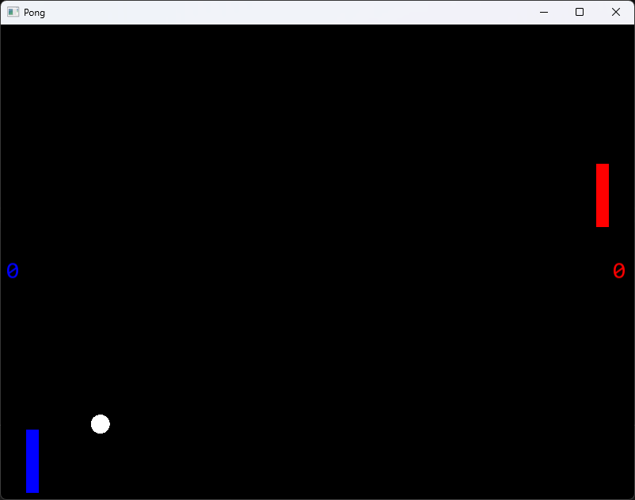

# Image of the game



# How to play ?
Left racket :\
Move up : <kbd>Z</kbd>\
Move down : <kbd>S</kbd>

Right racket :\
Move up : <kbd>&uarr;</kbd>\
Move down : <kbd>&darr;</kbd>

Toggle pause : <kbd>Escape</kbd>

# How it works ?
> [!IMPORTANT]
> This project was made with Visual Studio 2022.
> You can find all he settings in the main.h file.\
> Therefore, you can change all the settings.

<br/>
For instance, if you want to change the speed of the rackets, you need to change these values.

```cpp
const float racketLSpeed{ 7.f };
const float racketRSpeed{ 7.f };
```

> [!NOTE]
> racketL : Left racket\
> racketR : Right racket


## Collision calculation
I used the Axis-Aligned Bounding Box (AABB) algorithm to calculate the intersections between the balls and the rackets or borders in 2D.

\

### $f(A,B) = (A_{\text{minX}} \leq B_{\text{maxX}} \land A_{\text{maxX}} \geq B_{\text{minX}}) \land (A_{\text{minY}} \leq B_{\text{maxY}} \land A_{\text{maxY}} \geq B_{\text{minY}})$

<br/>

> [!NOTE]
> If that interests you, you can read the article below.\
> https://developer.mozilla.org/en-US/docs/Games/Techniques/3D_collision_detection

# Main settings

## Window settings

```cpp
// Window properties
const string game_name{ "Pong" };
const unsigned int window_width{ 800 };
const unsigned int window_height{ 600 };
const unsigned int frame_limit{ 60 };
```

> [!WARNING]  
> The frame limit influences game speed.

## Game settings

```cpp
// Game properties
const Color playerLColor{ Color::Blue };
const Color playerRColor{ Color::Red };
const Color ballColor{ Color::White };
const Player defaultPlayer = PlayerRight;
const unsigned int maxScore{ 10 };
const float racketLSpeed{ 7.f };
const float racketRSpeed{ 7.f };
const float defaultBallSpeed{ 7.f };
// With each collision with a racket, the speed of the ball increases by this value
const float ballSpeedIncrease{ 0.15f };
```

## Volume
```cpp
// Racket collision sound
const float racketSoundVolume{ 10.f };
// Wall collision sound
const float wallSoundVolume{ 10.f };
```

> [!NOTE]
> The volume is clamped between 0 and 100. There is no danger in changing it.

## Racket properties
```cpp
// Left racket properties
const unsigned int racketLWidth{ 16 };
const unsigned int racketLHeight{ 80 };
const unsigned int racketLPosX{ 32 };
const unsigned int racketLPosY{ (window_height / 2) - (racketLHeight / 2) };
// Minimum and maximum location of the racket
const unsigned int racketLMinPosY{ 0 };
const unsigned int racketLMaxPosY{ window_height - racketLHeight };

// Right racket properties
const unsigned int racketRWidth{ 16 };
const unsigned int racketRHeight{ 80 };
const unsigned int racketRPosX{ window_width - 32 - racketRWidth };
const unsigned int racketRPosY{ (window_height / 2) - (racketRHeight / 2) };
// Minimum and maximum location of the racket
const unsigned int racketRMinPosY{ 0 };
const unsigned int racketRMaxPosY{ window_height - racketRHeight };
```

## Ball properties
```cpp
// Ball properties
const float ballRadius{ 12.f };
// Default location of the ball
const unsigned int ballPosX{ static_cast<unsigned int>(window_width / 2.f - ballRadius / 2.f) };
const unsigned int ballPosY{ static_cast<unsigned int>(window_height / 2.f - ballRadius) };
```
